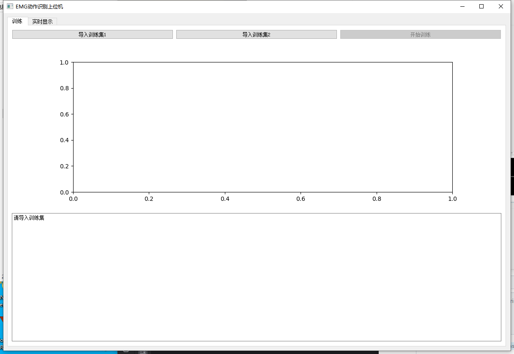
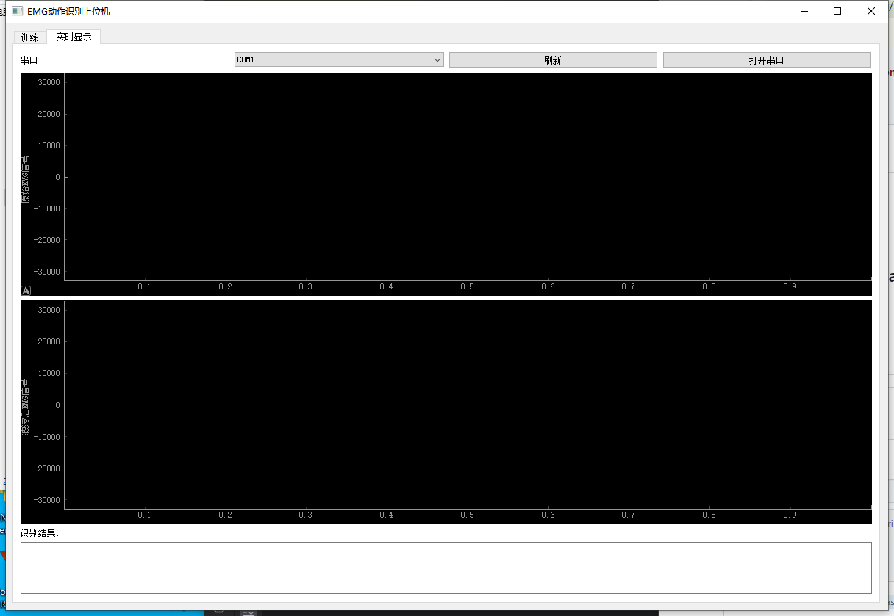
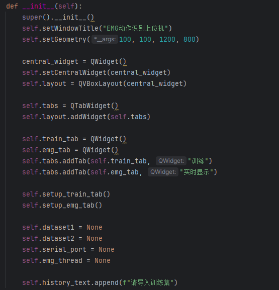
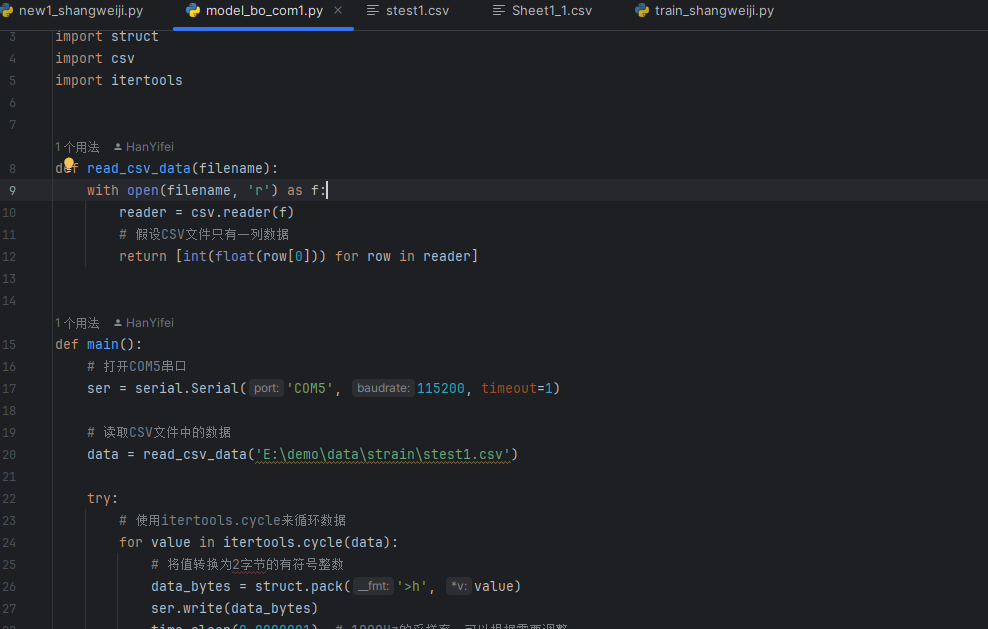
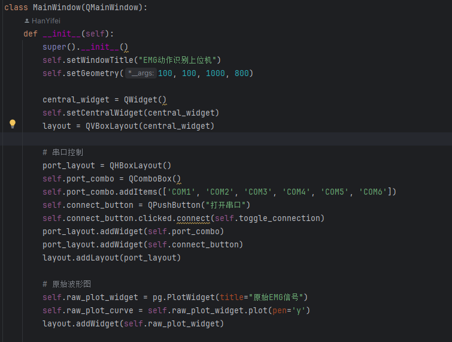

# EMG Action Recognition Upper Computer

This project is a Python-based upper computer program for EMG (Electromyography) action recognition. It can real-time collect EMG signals, perform filtering, and utilize a pretrained deep learning model for action recognition.

## Key Features

- Real-time EMG signal collection and display
- Signal filtering
- Action recognition based on LSTM
- Intuitive graphical user interface
- Real-time display of action recognition results and historical records

## Technology Stack

- Python 3.8
- PyQt5: For building the graphical user interface
- PyQtGraph: For real-time data visualization
- PySerial: For serial communication
- NumPy: For numerical computing
- SciPy: For signal processing
- PyTorch: For deep learning models

## Installation

1. `pip install PyQt5`
2. `pip install PySerial`
3. `pip install PyQtGraph`
4. `pip install NumPy`
5. `pip install SciPy`
6. `pip install PyTorch`

## Usage

1. Run the main program:
2. Select the correct serial port on the interface and click "Open Serial Port"
3. Observe real-time EMG signals and filtered signals
4. View action recognition results and historical records

## Project Structure

- `new1_shangweiji.py`: Main program entry point
- `train3_best.py`: LSTM model training
- `signal_processing.py`: Signal processing functions
- `train_shangweiji.py`: Graphical user interface definition
- `emg_classifier.pth`: Pretrained model weights
  
  
  

## Contribution

Feel free to submit issues and pull requests.

